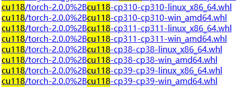

# PyTorch安装指南：适用于不同CUDA版本

编写时间：2023/12/20

1. 选择合适的PyTorch版本
2. 安装！

## 选择合适的PyTorch版本

torch没有像tensorflow一样，有非常方便的gpu安装支持。所以安装pytorch还是有挑战的。

第一步：**不要**再使用pip的方式去直接下载torch安装了，这种方式安装的torch一般都**无法调用GPU**，因为pip默认下载的CPU版本的torch。

第二步：去torch官网下载whl版本。打开`Pytorch WHL 下载页面`[https://download.pytorch.org/whl/torch_stable.html](https://download.pytorch.org/whl/torch_stable.html)，可以看到有很多下载链接。为了快速找到适合你的torch，使用浏览器的查找功能按下`Ctrl + F`可以打开查找窗口，输入cu118就可以查询适配CUDA 11.8的pytorch版本。同理cu117就是`CUDA 11.7`，cu121就是`CUDA 12.1`。截止到2023年12月20日，torch支持的最新CUDA版本是12.1。

> 只有带cuXXX的才支持调用GPU

<p align="center">
    
</p>

找到想要安装的torch后，例如我要安装torch-2.0.0，然后你会发现它有多个版本

<p align="center">
    
</p>

让我给你捋一捋，拿`torch-2.0.0%2Bcu118-cp310-cp310-linux_x86_64.whl`给你举例，`torch-2.0.0`是torch的版本，cu118代表这是CUDA 11.8的torch，`cp310-cp310`说明这是给python 3.10准备的，`linux_x86_64`表示这个是给linux版本的。

没听懂？那再把上面的看几遍！同理`torch-2.0.0%2Bcu118-cp311-cp311-win_amd64.whl`就是给CUDA11.8，Python 3.11，Windows平台准备的`torch-2.0.0`。

<p align="center">
    
</p>

找到你想要的版本，这个时候，你就可以把torch下载下来了。

要使用torch跑训练，只安装torch是不行的，通常需要安装torch+torchaudio+torchvision这三件套。需要注意的是，这三个东西是**有对应关系的**。下面是我总结的表格，只总结了>2.0.0的版本。

**↓torch版本关系表格↓**

<table>
  <tr>
    <th>torch</th>
    <th>torchaudio</th>
    <th>torchvision</th>
  </tr>
  <tr>
    <td>2.0.0</td>
    <td>2.0.0</td>
    <td>0.15.0</td>
  </tr>
  <tr>
    <td>2.0.1</td>
    <td>2.0.2</td>
    <td>0.15.2</td>
  </tr>
  <tr>
    <td>2.1.0</td>
    <td>2.1.0</td>
    <td>0.16.0</td>
  </tr>
  <tr>
    <td>2.1.1</td>
    <td>2.1.1</td>
    <td>0.16.1</td>
  </tr>
  <tr>
    <td>2.1.2</td>
    <td>2.1.2</td>
    <td>0.16.2</td>
  </tr>
</table>

记得找到对应的CUDA和python版本，不要选错平台。

## 安装

下载好三个文件后，你就可以安装它了。使用pip安装这些文件，首先你要把它们放在一个文件夹里面。

### Linux

```bash
cd path_to_torch/
pip install ./torch*
```

### Windwos

```cmd
cd path_to_torch\
pip install .\torch*
```