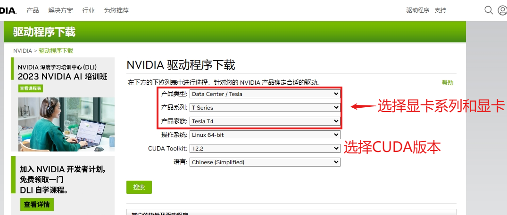

# 在ubuntu上安装显卡驱动-cuda-cudnn

相较于windwos平台，linux平台训练ai更受欢迎。linux通常比windows平台的稳定性更好，而且linux平台能调用更多的资源。并且，tensorflow 2.10以后的版本就不再支持windows平台了。有些时候我们不得不用linux进行训练，所以，这篇文章会帮助你在linux安装最基础的显卡驱动，CUDA和CUDNN。

> linux版本：`ubuntu-server 22.04` (ubuntu平台有更快捷的安装方式，但是这篇文章不介绍，你可以在我的其他文章里找到)  
> gpu：`NVIDIA 特斯拉T4`  
> cuda：`11.8`  
> cudnn：`8.6`

### 目录

1. 安装显卡驱动
2. 安装CUDA 11.8
3. 安装cudnn 8.6
4. 疑难杂症

### 安装显卡驱动

首先从安装显卡驱动开始，在安装显卡驱动前，需要先安装gcc等依赖和禁用linux自带的驱动`nouveau`。

```bash
# 安装依赖
sudo apt update
sudo apt install build-essential libglvnd-dev pkg-config -y

# 禁用nouveau
# 使用驱动自动禁用，注意使用这样的方式禁用，安装完成之后必须重启
sudo bash ./NV* --disable-nouveau
# 手动禁用
sudo bash -c "echo blacklist nouveau > /etc/modprobe.d/blacklist-nvidia-nouveau.conf"
sudo bash -c "echo options nouveau modeset=0 >> /etc/modprobe.d/blacklist-nvidia-nouveau.conf"


# 更新内核
sudo update-initramfs -u

# 重启
sudo reboot

# 重启完成后若该↓命令没有任何输出
# 代表禁用成功
lsmod | grep nouveau
```

随后，要先去nvidia官网下载适用于你显卡的驱动文件。nvidia驱动下载地址 ( *[https://www.nvidia.cn/Download/index.aspx?lang=cn](https://www.nvidia.cn/Download/index.aspx?lang=cn)* )  
把下载的驱动上传到linux后，先为驱动添加执行权限，随后用root执行安装文件。



```sh
# 请修改驱动名为自己的驱动名
# 执行安装文件
sudo bash ./NV*
```

在启动安装文件后，会有界面引导你安装。


在程序成功执行成功后，你可以用`nvidia-smi`命令检查驱动有没有正常安装。到此安装显卡驱动就结束了。

### 安装CUDA

这里以安装cuda 11.8为例，到cuda的官网下载cuda ( *[https://developer.nvidia.com/cuda-toolkit-archive](https://developer.nvidia.com/cuda-toolkit-archive)* )  
找到cuda 11.8，点进去选择系统、架构、发行版、版本、然后点击带有`runfile (local)`按钮。接着就会下面出现两行代码，把它复制到linux系统中执行。  
在cuda安装的过程中，也有简单的引导界面。有一些选项要更改。

```sh
# 第一行是下载CUDA安装文件
# 如果linux无法下载，可以了去掉 wget 
# 把链接复制到浏览器中，让windwos把
# 文件下载下来，随后再上传到linux
wget https://developer.download.nvidia.com/compute/cuda/11.8.0/local_installers/cuda_11.8.0_520.61.05_linux.run
# 第二行是安装
sudo sh cuda_11.8.0_520.61.05_linux.run
```


等待cuda程序运行完成后，还需要为cuda配置环境变量才可以使用cuda。

```bash
# 打开环境变量文件
vim ~/.bashrc

# 在最底下加入这两行
# 请注意添加实际的路径
export PATH=/usr/local/cuda-11.8/bin${PATH:+:${PATH}}
export LD_LIBRARY_PATH=/usr/local/cuda-11.8/lib64${LD_LIBRARY_PATH:+:${LD_LIBRARY_PATH}}
```

最后用`nvcc -V`测试cuda的环境变量是否配好就行了。到此安装cuda的教程结束。

### 安装cudnn

cudnn是为人工智能神经网络专门开发的工具包。它是单独独立出来的，想要在linux中安装它也很简单，只需要把cudnn文件复制到cuda的安装目录并添加权限就可以了。  
首先前往cudnn的官网下载cudnn驱动工具包 ( *[https://developer.nvidia.com/rdp/cudnn-archive](https://developer.nvidia.com/rdp/cudnn-archive)* ) 注意根据自己安装的cuda版本选择合适的cudnn版本。找到合适的后，点击该版本展开下载选项。找到`Local Installer for Linux x86_64 (Tar)`点击下载。  

> 如果你没有登录nvidia账号，那么他会让你跳转登录，在登录完成后，重复一次找版本的操作就可以下载。


下载完成后，你得到了`cudnn**.tar.xz`，把这个文件上传到服务器，把它解压。可以看到压缩文件里有`include`和`lib`两个文件夹，要把这里面的文件分别复制到`/usr/loacl/cuda-*/`下的`include`和`lib64`下。在复制过去后，要为复制过去的文件添加权限，我选择权限全开!

```bash
# 解压文件夹
tar -xvf cudnn*.tar.xz
# 先前往复制的目的文件夹
# (不要问我为什么这么麻烦，因为我被坑过，不想再被坑了)
cd /usr/local/cuda-*/
cd include
# 复制文件
# 记得改路径哦
sudo cp ~/cudnn*/include/cudnn* ./
# 添加权限
sudo chmod 777 ./cudnn*
# 切换到动态链接库
cd ../lib64
# 复制文件
sudo cp -P ~/cudnn*/libcudnn* ./
# 添加权限
sudo chmod 777 ./libcudnn*
sudo chmod a+r /usr/local/cuda/include/cudnn*.h /usr/local/cuda/lib64/libcudnn*
```


这样，cudnn的安装就结束了

cudnn_v8，验证安装
```bash
# 安装依赖
sudo apt install libfreeimage-dev build-essential -y

# 克隆测试代码
git clone https://github.com/fenghan0430/cudnn_samples_v8.git
cd cudnn_samples_v8/mnistCUDNN/

# 编译测试程序
make clean && make

# 运行测试
./mnistCUDNN

# 出现Test passed!就是安装成功
```

### 疑难杂症

1. BIOS设置
   - 开始 `SR-IOV`
   - 关闭`安全引导`
   - 开启`Memory Mapped I/O (MMIO) above 4GB`
