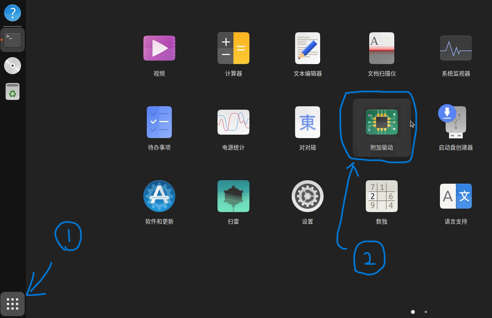
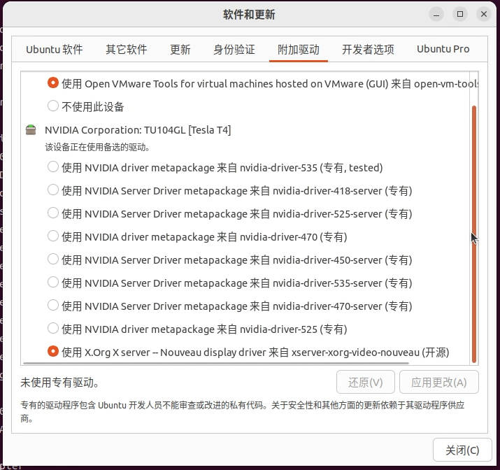
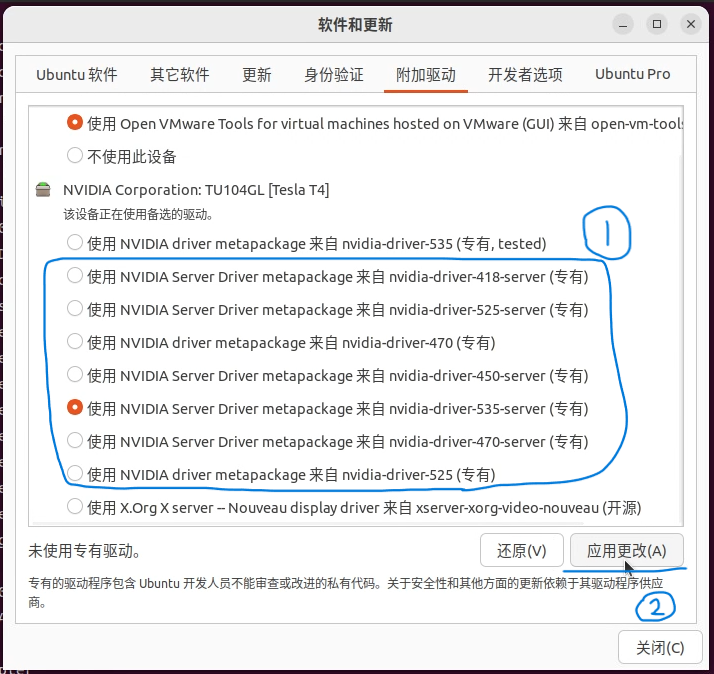
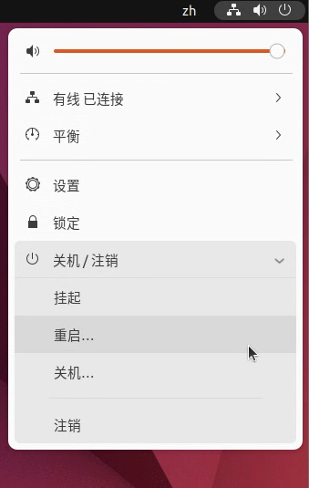
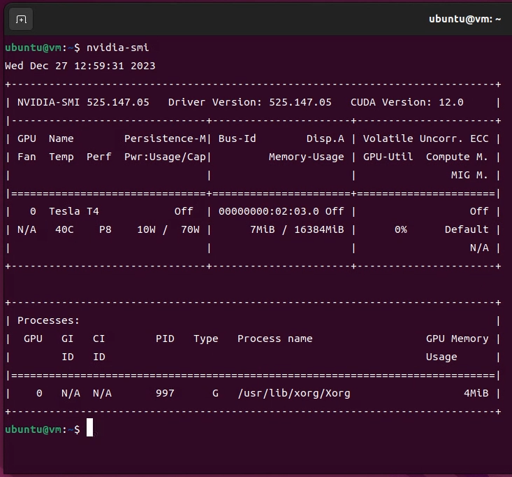

# 适用于ubuntu的快速安装显卡驱动指南

*编写时间 2023-12-22*

在深度学习领域，拥有高效的计算资源是至关重要的。NVIDIA的GPU因其出色的并行处理能力而成为深度学习实验的首选。本指南旨在帮助用户在Ubuntu系统中快速安装NVIDIA显卡驱动，从而为深度学习搭建高效的计算环境

本文提供了图形化界面和命令界面**两种场景**的解决方案

同时发现了一种解决掉显卡驱动的解决方案

### 📜系统要求和准备

首先你需要确保的你的机器上已经有NVIDIA显卡，并且系统能正确识别它：

```bash
# 查看设备信息
ubuntu-drivers devices
```

运行后会显示ubuntu系统现在能识别到的显卡：

```
### ubuntu-drivers devices 输出 ###
== /sys/devices/pci0000:03/0000:03:00.0 ==
modalias : pci:v000010DEd00002204sv00001458sd0000403Bbc03sc00i00
vendor   : NVIDIA Corporation
model    : GA102 [GeForce RTX 3090]
manual_install: True
driver   : nvidia-driver-470 - distro non-free
driver   : nvidia-driver-545 - third-party non-free recommended
driver   : nvidia-driver-525-server - distro non-free
driver   : nvidia-driver-535 - third-party non-free
driver   : nvidia-driver-545-open - third-party non-free
driver   : nvidia-driver-470-server - distro non-free
driver   : nvidia-driver-525 - distro non-free
driver   : nvidia-driver-525-open - distro non-free
driver   : nvidia-driver-535-server - distro non-free
driver   : nvidia-driver-535-open - third-party non-free
driver   : nvidia-driver-535-server-open - distro non-free
driver   : xserver-xorg-video-nouveau - distro free builtin
### ubuntu-drivers devices 输出 ###
```

然后，你要确保你的系统软件包是最新的，避免出现兼容性问题

```bash
# 更新系统和软件包
sudo apt update && sudo apt upgrade -y
```

### 命令行⌨️

如果使用命令行的方式安装显卡驱动（**这是最快捷的方式，也是我推荐的方式**），你只需要执行下面的命令。

> 🥰两种方案，二选一

```bash
# 方式1：使用系统工具自动安装
# 使用这个方法会安装带有`recommended`字段的驱动
sudo ubuntu-drivers autoinstall

# 方式2：
# 或者你想要安装特定版本的驱动，你只需要这样
sudo apt install nvidia-driver-535
# 使用apt命令再加上上面驱动列表任意一个驱动
```

> 选择合适的驱动，个人**不建议**安装带`open`的驱动；如果是**图形化**界面，**不要**安装带`server`的驱动。

在安装脚本运行完成后你需要重启电脑。

```bash
# 重启
sudo reboot
```

重启完成后使用这条命令查看驱动是否安装成功。

```bash
# 查看NVIDIA
nvidia-smi
```

如果成功输出了显卡信息，代表驱动安装成功了。

### 图形化界面💻

使用图形化界面安装驱动，首先打开ubuntu里面的`附加驱动`的应用程序。

<p align="center">
    
</p>

稍等一下，附加驱动就会加载出来当前机器能安装的驱动。

<p align="center">
    
</p>

> 😨选择合适的驱动，个人**不建议**安装带`open`的驱动；如果是**图形化**界面，**不要**安装带`server`的驱动。

选中想要安装的驱动后，点击应用更改，开始安装。

<p align="center">
    
</p>

在安装脚本执行完成后，重启电脑。

<p align="center">
    
</p>

重启后打开终端，输入命令查看驱动是否安装成功。🥰

```bash
# 查看NVIDIA
nvidia-smi
```

<p align="center">
    
</p>

### 解决掉驱动问题

安装完驱动后，你可能会发现在某次**重启**过后，使用nvidia-smi它输出会出现:

```log 
ERROR: NVIDIA-SMI has failed because it couldn't communicate with the NVIDIA driver. Make sure that the latest NVIDIA driver is installed and running.
```

*这就是掉显卡驱动的现象之一。*😭

首先，你要检查一下系统有没有识别到显卡:

```bash
# 检查显卡🐧
lspci | grep NVIDIA
```

如果能看到有显卡，那么就可以确定，你的显卡驱动掉了**T_T**。通常**重装显卡驱动**就可以解决这个问题。

```bash
# 示例是使用包管理器的方法安装和卸载驱动🚀

# 卸载原有显卡驱动
sudo apt purge nvidia-* -y

# 卸载后重启一次
sudo reboot

# 重新安装驱动
sudo ubuntu-drivers autoinstall
# 或
sudo apt install nvidia-driver-545 -y

# 安装完后重启
sudo reboot

# 如果一切顺利，显卡驱动就安装成功了
nvidia-smi
```

如果你想一劳永逸的解决掉驱动问题，那就需要知道为什么会掉驱动？🎯

在ubuntu系统上，掉驱动的原因是内核在更新的过程中丢失了关于显卡的信息😵。从而导致系统上安装的显卡驱动和`nvidia-smi`命令找不到显卡🤬。

重装驱动能解决这个问题，是因为重装驱动让驱动重新从linux内核中建立了显卡信息，所以驱动回复正常了。

把内核设置成不更新的状态，就可以解决这个问题了。

```bash
# 设置内核不更新
sudo apt-mark hold linux-image-$(uname -r)
```

> **注意**😨：不让内核更新也意味着没有办法及时获取新的功能和内容
