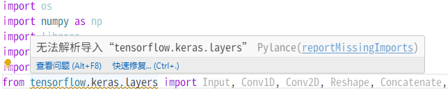
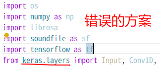
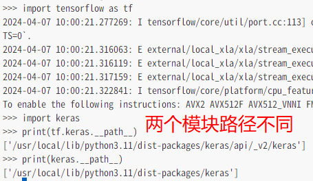
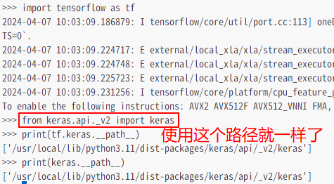
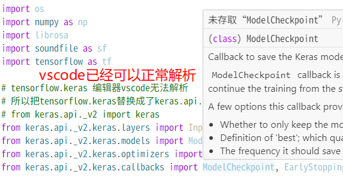

# vscode无法解析导入"tensorflow.keras"解决

### 遇到的问题

如图所示，在vscode中使用tensorflow内置的keras，出现无法解析的情况。在这种情况下，vscode中的python编辑器无法给出任何有关keras的代码提示和文档。

在代码的编辑中，这非常要命，甚至会让人想放弃vscode。但是热爱vscode的封翰君是不会放弃的，我找到了一个办法。

### 为什么会出现这个问题

我在网上查到，出现这个情况是因为tensorflow有`延迟引入`这个功能，导致vscode经常没有办法解析tensorflow中的模块keras。

### 解决方案

像**上图**这种方法虽然可以正常解析，但是这和tensorflow.keras已经不是一个东西了，具体原因看**下图**

为了确保不出问题，我还是使用和tf.keras路径相同的模块

